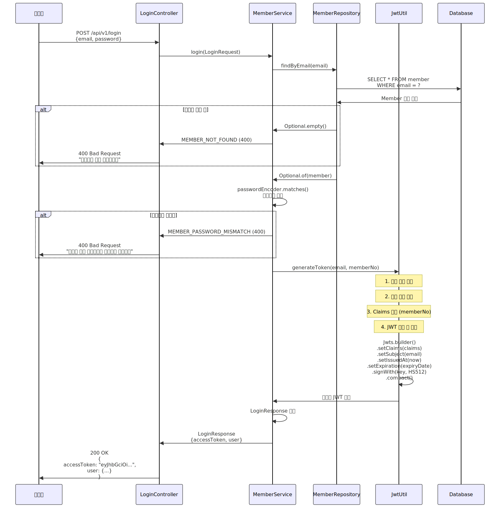
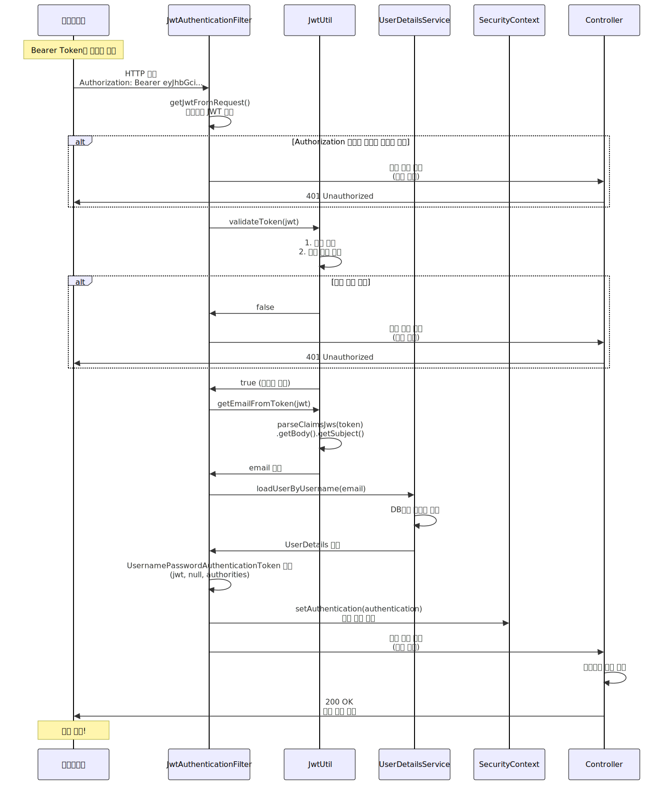

# JWT 발급 및 인증 과정

## JWT 발급 흐름 다이어그램

\pagebreak

## JWT 인증 흐름 다이어그램

\pagebreak

## 1. 📌 JWT 발급 흐름 (로그인 요청 처리 : MemberServiceImpl.login)

1.	회원 조회
    - 이메일로 DB에서 회원 정보 조회
    - 미존재 시 MEMBER_NOT_FOUND 예외 발생
2.	비밀번호 검증
    - BCrypt로 암호화된 저장된 비밀번호와 입력값 비교
    - 불일치 시 MEMBER_PASSWORD_MISMATCH 예외 발생
3.	JWT 생성 (JwtUtil.generateToken)
    - memberNo 클레임 포함
    - 이메일을 subject로 설정
    - HS512 알고리즘으로 서명
    - 발급 시간 및 만료 시간 설정
4.	응답 반환
    - accessToken 및 사용자 정보를 JSON으로 반환

## 2. 🔐 JWT 인증 절차 (인증 필터 동작 : JwtAuthenticationFilter)

1. 모든 요청 전에 필터가 실행됨 (OncePerRequestFilter)
2. 요청 헤더의 Authorization 값에서 JWT 추출
3. JwtUtil.validateToken()으로 유효성 검증
4. 유효한 경우:
    - 토큰에서 이메일 추출
    - UserDetailsService로 사용자 정보 조회
    - SecurityContextHolder에 인증 객체 저장

## 4. 보안 설정 (SecurityConfig)

### ✅ 접근 권한 설정

- 다음 경로는 인증 없이 접근 허용:
    - `/users/signup`, `/users/login`
    - Swagger UI: `/swagger-ui/**`, `/v3/api-docs/**`
    - 헬스 체크: `/api/health/**`
- 그 외 모든 경로는 인증 필요

### ⚙️ 필터 체인 구성

- JwtAuthenticationFilter를 UsernamePasswordAuthenticationFilter 앞에 등록
- 예외 상황 처리 핸들러 설정:
    - 인증 실패: CustomAuthenticationEntryPoint → 401 응답
    - 권한 부족: CustomAccessDeniedHandler → 403 응답

\pagebreak

## 5. 예외 처리

### 🚫 CustomAuthenticationEntryPoint

- JWT가 없거나 잘못되었을 때 실행
- 응답: 401 Unauthorized + JSON 에러 메시지

### 🚫 CustomAccessDeniedHandler

- 유효한 JWT는 있지만 권한이 부족할 때 실행
- 응답: 403 Forbidden + JSON 에러 메시지
